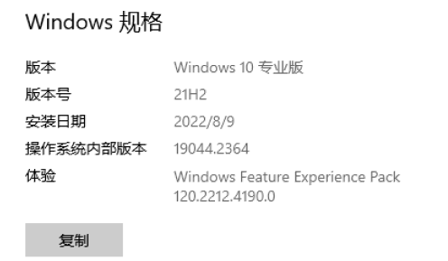
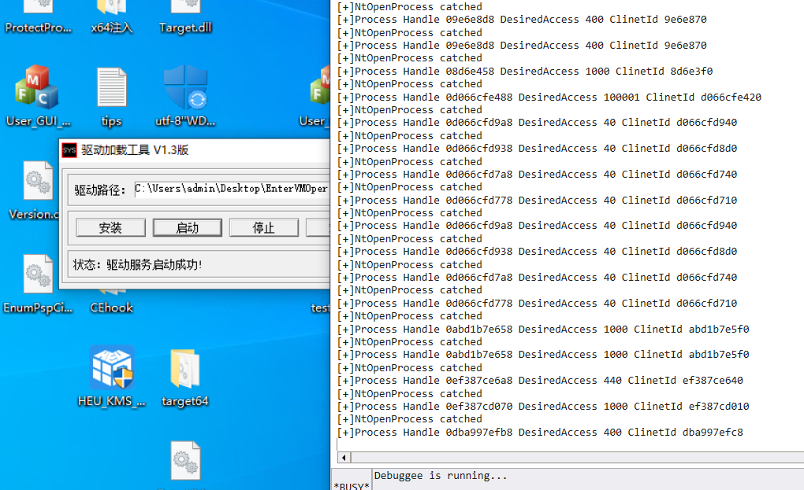

==玩具VT,简易框架,VMX开启支持Win10,==

==SysCallHook不支持装了KPTI补丁(双Cr3)的操作系统==

==理论支持win7-win10 21h2==

参考:

https://hbxiaock.bk-free01.com/ADDD/8ee4

https://github.com/huoji120?tab=repositories

https://revers.engineering/patchguard-detection-of-hypervisor-based-instrospection-p1/

==测试系统==



==测试效果 Hook NtOpenProcess==

```c++
SyscallHook::GetInsctance()->fn_syshook_init(0xfffff800832018c0, 0xfffff8008280aa90, 0xfffff800827f9630, 0xfffff8008280bbc0,FALSE);
SyscallHook::GetInsctance()->fn_add_hook_by_index(0x26, (UINT64)MyOpenProcess);
```

```c++
NTSTATUS MyOpenProcess(	_Out_ PHANDLE ProcessHandle,
	_In_ ACCESS_MASK DesiredAccess,
	_In_ POBJECT_ATTRIBUTES ObjectAttributes,
	_In_opt_ PCLIENT_ID ClientId) {
	asm_stac();
	DbgPrintEx(77, 0, "[+]NtOpenProcess catched\r\n");
	DbgPrintEx(77, 0, "[+]Process Handle 0%llx DesiredAccess %x ClinetId %llx\r\n",ProcessHandle,DesiredAccess,ClientId);

	return NtOpenProcess(ProcessHandle, DesiredAccess, ObjectAttributes, ClientId);
}
```




# 0X3 基于VMM的syscallHook

## 0x3-1 Hook思路

拦截C0000082的读写调用

读则返回原先的值,写则禁止写入,实际上通过修改MSR的LSTAR,来进行syscallHook;

从而达到,外部读MSR的SyscallRip没有问题,但是实际syscall调用是直接调用到的修改过的MSR上的。

因为涉及到修改IA32_LSTAR,所以自己需要重写一份KiSyscall64(Shadow)，在逻辑中进行判断是否是需要Hook的SSDT Index;

## 0x3-2 PG的检测

值得一提的是,PG会检测IA32_LSTAR的修改。检测手段如下:

```assembly
KiErrata704Present proc near           

mov     ecx, 0C0000084h
rdmsr
push    rdx
push    rax
and     eax, 0FFFFFEFFh ; MSR_FMASK的TF位置位
wrmsr
pushfq
or      [rsp+18h+var_18], 100h ; 置位TF
popfq
syscall                 ; TF置位,FMASK不屏蔽 syscall异常
mov     r10, rcx
mov     ecx, 0C0000084h
pop     rax
pop     rdx
wrmsr
mov     rax, r10
retn
```

简而言之,通过设置IA32_FMASK,去掉TF单步位,从而导致syscall的时候产生异常,此时进入#DB异常，RIP在堆栈,PG检测RIP和原先的KiSyscall64是否一样,不一样则PG;

### 0x3-2-1 攻击方法(猜想)

- 拦截IA32_FMASK的读写
- 拦截TF异常,比较堆栈RIP是否是自己的Hook的KiSystemCall64,是则直接返回

